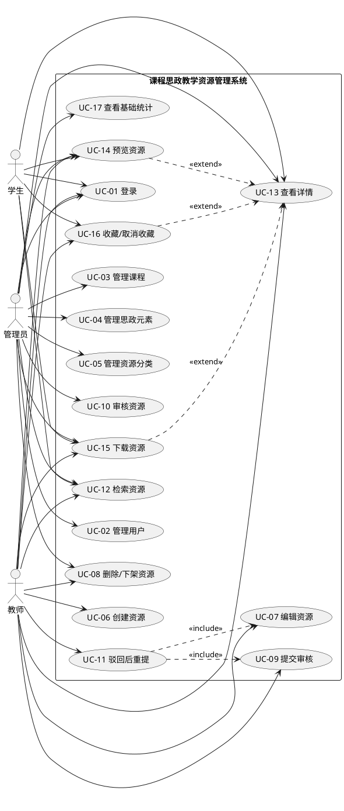

# 03 系统用例与规约

本章区分业务用例和系统交互。所有受保护用例均以有效登录为公共前置条件；所有写操作由后端再次校验角色、资源归属及当前状态。`UC-01` 是其余受保护用例的认证入口。

第三阶段实现说明：仅落实教师本人DRAFT的创建、列表、详情、编辑与软删除；下文其他资源状态、提交审核和使用类用例仍是完整系统的后续设计。草稿允许0..N个元素，提交/重新提交审核至少1个有效元素，不能混用两个阶段的校验条件。

第四阶段现状：UC-07扩展到本人REJECTED；UC-09/10/11已实现，UC-13增加本人四状态及管理员已提交三状态的详情/历史。审核材料读取属于UC-10的授权附件动作，不计普通下载；UC-12及公开使用、收藏、统计仍未实现。管理员不可查看从未提交的草稿。

## 用例清单

| 编号 | 用例 | 主要参与者 | 对应需求 |
|---|---|---|---|
| UC-01 | 登录 | 管理员、教师、学生 | FR-01 |
| UC-02 | 管理用户 | 管理员 | FR-02 |
| UC-03 | 管理课程 | 管理员 | FR-03 |
| UC-04 | 管理课程思政元素 | 管理员 | FR-04 |
| UC-05 | 管理资源分类 | 管理员 | FR-05 |
| UC-06 | 创建教学资源 | 教师 | FR-06 |
| UC-07 | 编辑教学资源 | 教师 | FR-06 |
| UC-08 | 删除/下架资源 | 教师、管理员 | FR-06/07 |
| UC-09 | 提交资源审核 | 教师 | FR-07 |
| UC-10 | 审核教学资源 | 管理员 | FR-07 |
| UC-11 | 驳回后重新提交 | 教师 | FR-07 |
| UC-12 | 检索已发布资源 | 管理员、教师、学生 | FR-08 |
| UC-13 | 查看资源详情 | 管理员、教师、学生 | FR-08/09 |
| UC-14 | 预览资源 | 管理员、教师、学生 | FR-08 |
| UC-15 | 下载资源 | 管理员、教师、学生 | FR-08/09 |
| UC-16 | 收藏/取消收藏 | 教师、学生 | FR-09 |
| UC-17 | 查看基础统计 | 管理员 | FR-10 |

## 详细规约

### UC-01 登录

- 前置条件：用户已有账号，尚未取得有效登录凭据。
- 基本事件流：①输入账号与密码；②系统验证凭据和用户状态；③系统读取固定角色并建立会话/签发凭据；④前端进入相应首页。
- 备选/异常：账号或密码错误、用户停用、凭据过期时拒绝访问并给出不泄漏账号存在性的提示。
- 后置条件：成功时获得可用于后续请求的身份；失败时不创建有效会话。

### UC-02 管理用户

- 前置条件：管理员已登录。
- 基本事件流：①查看用户列表；②新增用户或选择已有用户；③填写/修改基本信息、固定角色和状态；④后端校验唯一账号及角色；⑤保存并返回结果。
- 备选/异常：重复账号、无效角色、非法状态值或越权请求被拒绝；停用不物理删除用户历史。
- 后置条件：用户记录与角色/状态更新，既有业务记录仍可追溯。

### UC-03 管理课程

- 前置条件：管理员已登录。
- 基本事件流：①查看课程；②新增或修改课程编号、名称、简介、状态；③系统校验编号唯一；④保存；必要时停用课程。
- 备选/异常：重复编号、字段不合法或试图物理删除被引用课程时拒绝；停用课程不可供新资源选择。
- 后置条件：课程基本信息更新，已有资源关联保持不变。

### UC-04 管理课程思政元素

- 前置条件：管理员已登录。
- 基本事件流：①查看元素列表；②新增/修改名称、说明和状态；③保存或停用。
- 备选/异常：重复名称、无效状态或对被引用元素的物理删除请求被拒绝。
- 后置条件：元素目录更新；历史资源标注仍保留。

### UC-05 管理资源分类

- 前置条件：管理员已登录。
- 基本事件流：①查看分类；②新增/修改分类名称与状态；③保存或停用。
- 备选/异常：重复分类或对已有引用分类的物理删除请求被拒绝。
- 后置条件：有效分类可供教师选择和用户检索，历史引用保留。

### UC-06 创建教学资源

- 前置条件：教师已登录；至少有可用课程和分类。
- 基本事件流：①填写标题、简介和分类；②选择一门课程，草稿可暂不标注或选择多个有效思政元素（0..N）；③上传符合限制的文件；④系统保存文件定位信息和资源元数据；⑤资源成为 `DRAFT`，创建者为当前教师。
- 备选/异常：课程/分类停用、元素无效、文件类型或大小不符、上传中断、必填信息缺失时不产生不完整资源；学生或管理员调用创建接口被拒绝。
- 后置条件：存在教师本人可见的草稿，文件与数据库记录一致。

### UC-07 编辑教学资源

- 前置条件：教师已登录；资源属于本人且为 `DRAFT` 或 `REJECTED`。
- 基本事件流：①打开本人资源；②修改基本信息、文件、课程或元素标注；③后端校验归属、状态和引用有效性；④保存更改。
- 备选/异常：他人资源、待审核/已通过资源、无效课程或非法文件均拒绝更新；上传失败不覆盖原有效文件。
- 后置条件：可编辑资源更新，状态仍为原状态，更新时间刷新。

### UC-08 删除/下架资源

- 前置条件：教师或管理员已登录；目标资源存在且未软删除。
- 基本事件流：①教师选择本人草稿/驳回资源删除，或管理员选择已通过资源下架；②后端校验角色、归属和状态；③写入 `deleted_at`；④资源退出对应列表。
- 备选/异常：待审核资源、教师删除他人资源、学生删除及重复删除均拒绝。
- 后置条件：资源不可再公开使用；关联和审核历史仍在数据库。

### UC-09 提交资源审核

- 前置条件：教师已登录；本人资源处于 `DRAFT`，标题、课程、分类和文件有效，至少关联 1 个思政元素且所有关联元素均有效。草稿保存不要求元素非空。
- 基本事件流：①选择提交；②系统校验归属、状态和内容完整性；③提交轮次增加；④状态变为 `PENDING`；⑤进入管理员待审核列表。
- 备选/异常：缺文件、失效课程/分类、无有效思政元素、重复提交或非本人提交时拒绝，状态不变。
- 后置条件：资源待审核，教师暂不能编辑。

### UC-10 审核教学资源

- 前置条件：管理员已登录；资源为 `PENDING`。
- 基本事件流：①管理员查看待审详情、轮次、附件；②选择通过或驳回；③驳回时填写1—1000字符原因；④携带页面所见submissionNo发起动作，系统锁定资源并核对PENDING及轮次；⑤同一事务追加审核记录并更新状态；⑥通过时记录发布时间，驳回后教师在详情查看原因。
- 备选/异常：资源状态已变化、驳回原因空白、非管理员操作或文件不可读时拒绝提交审核结论；并发审核只能成功一次。
- 后置条件：资源变为 `APPROVED` 或 `REJECTED`；审核记录不可修改。

### UC-11 驳回后重新提交

- 前置条件：教师已登录；本人资源为 `REJECTED`，可查看驳回意见。
- 基本事件流：①教师查看原因；②按 UC-07 修改资源，状态仍REJECTED且旧审核历史保留；③明确重新提交；④系统重新校验完整性（至少1个元素且全部有效），成功事务递增轮次并置PENDING。
- 备选/异常：内容不完整、课程/分类/任一元素失效、附件无效、其他教师重提、状态非草稿/驳回时拒绝；不以“是否改过字段”代替业务完整性校验。
- 后置条件：资源重新进入待审核队列，旧审核记录保留。

### UC-12 检索已发布资源

- 前置条件：用户已登录。
- 基本事件流：①输入关键词、课程、分类、元素等可选条件；②系统组合查询 `APPROVED` 且未下架的资源；③返回分页列表。
- 备选/异常：条件无效时提示；无结果时返回空列表；直接传未审核状态无法扩大可见范围。
- 后置条件：只显示可公开使用的资源，不改变数据。

### UC-13 查看资源详情

- 前置条件：用户已登录；资源已发布，或管理员/创建者具有查看未审核资源的职责权限。
- 基本事件流：①打开资源；②后端校验公开状态或专属权限；③返回详情、课程、元素和允许操作；④公开资源成功展示后增加浏览记录。
- 备选/异常：未授权、已下架或不存在时不返回文件定位信息；未审核资源访问不计入公开浏览统计。
- 后置条件：详情可见；必要时新增一条浏览记录。

### UC-14 预览资源

- 前置条件：用户已登录，具有该资源文件的访问权限。
- 基本事件流：①选择预览；②后端校验角色、归属/发布状态与文件存在性；③对支持浏览器显示的文件以安全响应头输出内容。
- 备选/异常：不支持的格式提示下载或不可预览；文件不存在、已下架或越权时拒绝。
- 后置条件：文件内容被授权显示，不改变审核状态。

### UC-15 下载资源

- 前置条件：用户已登录，资源已发布；管理员审核查看文件的动作不计入普通下载。
- 基本事件流：①选择下载；②后端校验身份、资源状态和文件；③开始输出附件并新增下载记录；④前端获得文件。
- 备选/异常：未审核、已下架、文件缺失、越权请求或传输准备失败时不增加成功下载记录。
- 后置条件：获授权的下载行为可用于基础统计。

### UC-16 收藏/取消收藏

- 前置条件：教师或学生已登录；资源已发布。
- 基本事件流：①点击收藏或取消；②后端校验角色与资源可见性；③新增收藏记录或切换有效状态；④返回当前收藏状态。
- 备选/异常：管理员、未审核资源、重复收藏或重复取消按明确结果处理，不产生重复有效收藏。
- 后置条件：用户当前收藏状态改变，统计以有效收藏为准。

### UC-17 查看基础统计

- 前置条件：管理员已登录。
- 基本事件流：①选择统计页；②系统按既定口径聚合用户、课程、资源、审核状态、分类、元素、浏览、下载与收藏数据；③展示结果。
- 备选/异常：非管理员拒绝；无数据维度返回 0/空集合；查询失败统一异常响应。
- 后置条件：获得描述性统计，不修改原始业务记录。

## 系统用例图源码（PlantUML）

