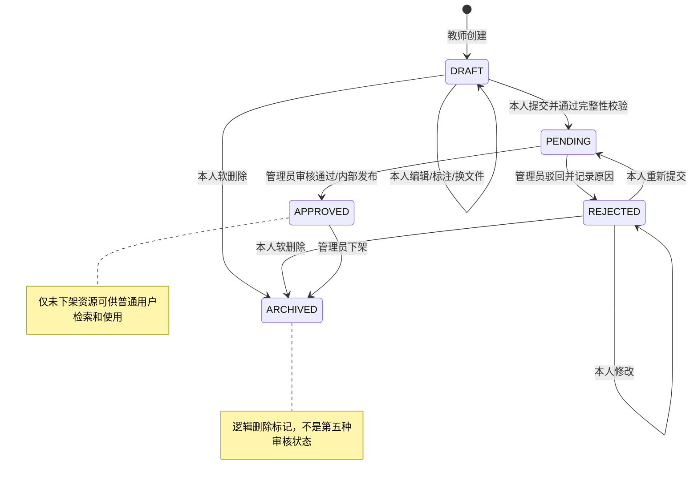
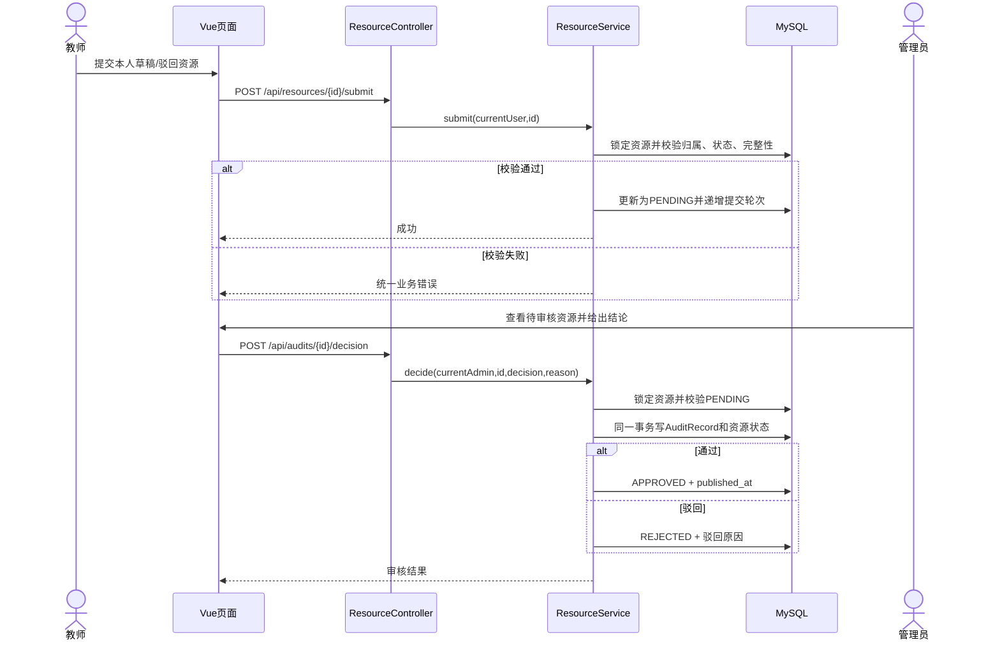
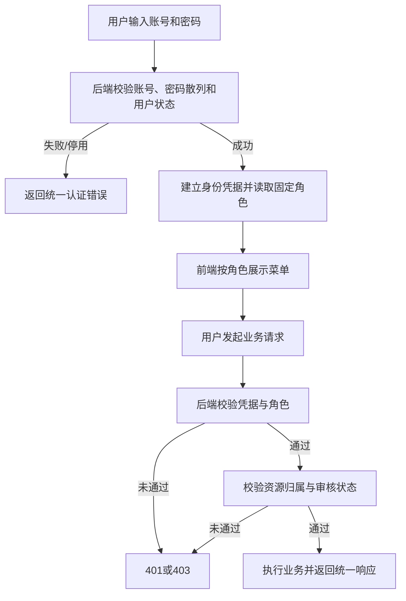
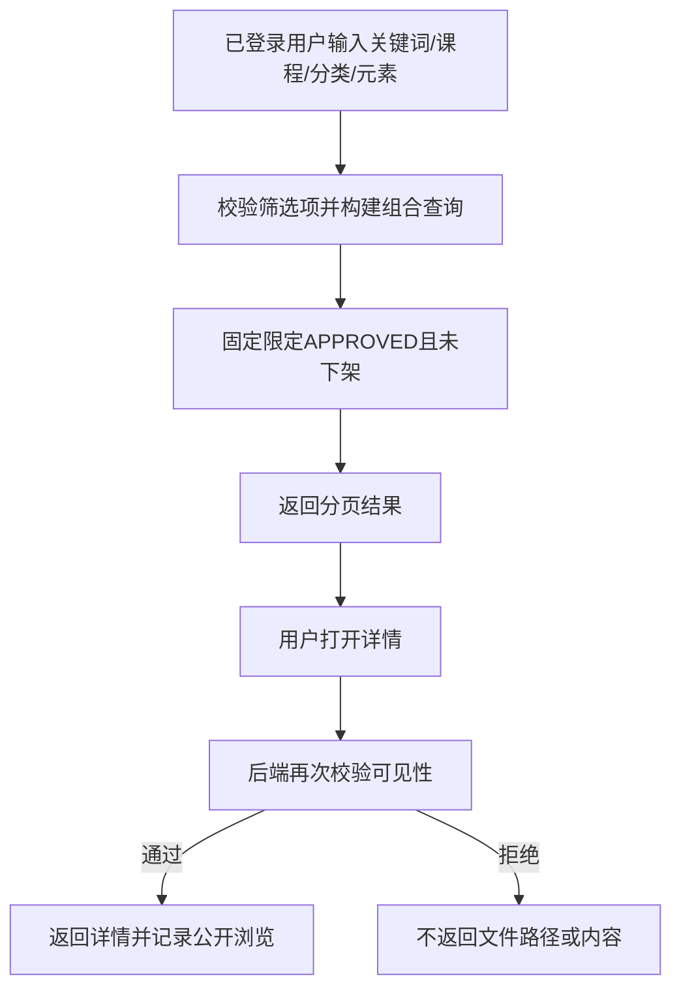
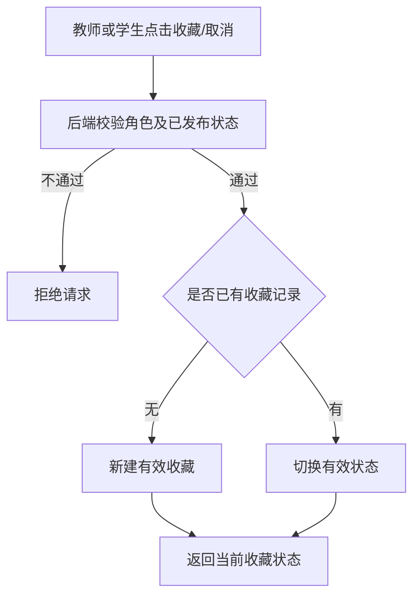
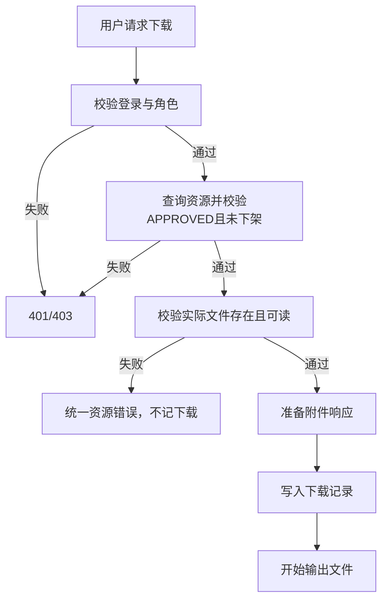

# 04 业务流程与关键时序

## 1. 资源生命周期

提交与审核属于状态转换，必须由后端在事务中校验。管理员通过时同时写审核记录、置为 `APPROVED` 并写 `published_at`；驳回时写审核原因并置为 `REJECTED`。删除/下架只写 `deleted_at`，不物理清除审核历史。

`ARCHIVED` 只是图中的终止可见性节点，对应 `deleted_at IS NOT NULL`，不是资源审核状态枚举值。教师不得直接编辑待审核和已通过的资源。

第三阶段只实现 `DRAFT → DRAFT` 和 `DRAFT → ARCHIVED`，不实现提交或审核。草稿允许 0..N 个思政元素；将来 `DRAFT/REJECTED → PENDING` 时须至少 1 个有效元素，不能把该条件提前强加给草稿保存。

### 审核关键时序（Mermaid）

## 2. 登录与权限判断

## 3. 检索与查看

## 4. 收藏

收藏表按 `(user_id, resource_id)` 唯一；取消收藏改变当前有效状态。统计“收藏量”只计有效收藏，避免重复收藏使计数膨胀。

## 5. 下载

下载记录表示通过授权且文件已准备输出的请求，不推断用户是否完整保存了文件。预览同样经过权限和文件检查，但不计作下载。
