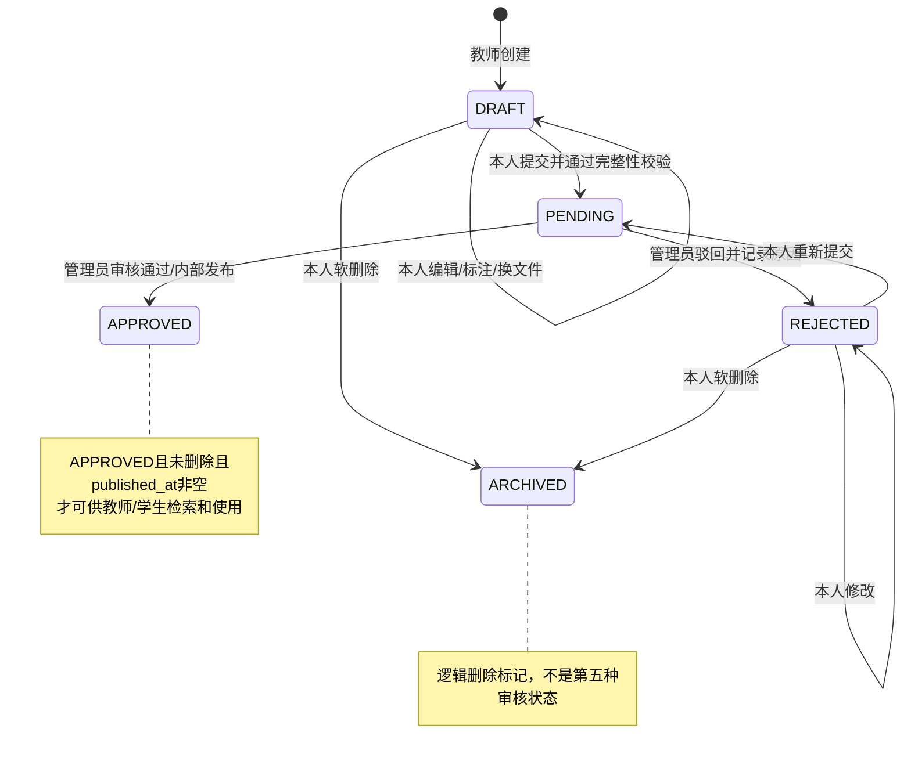
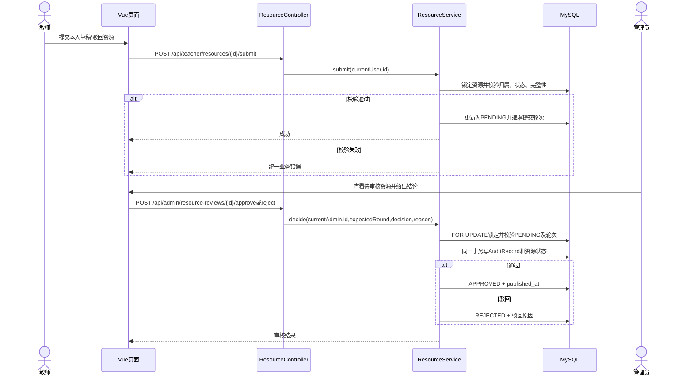
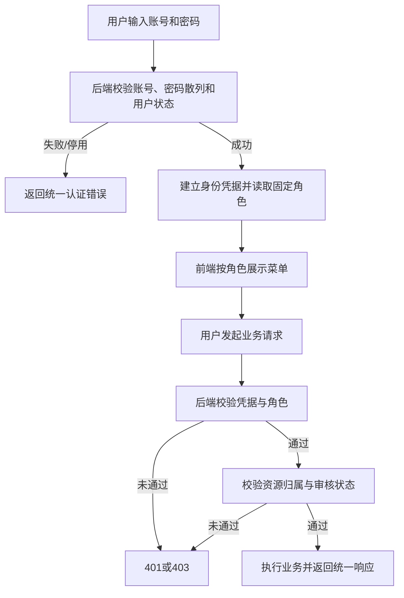
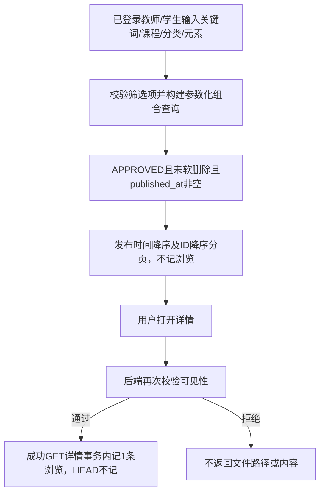
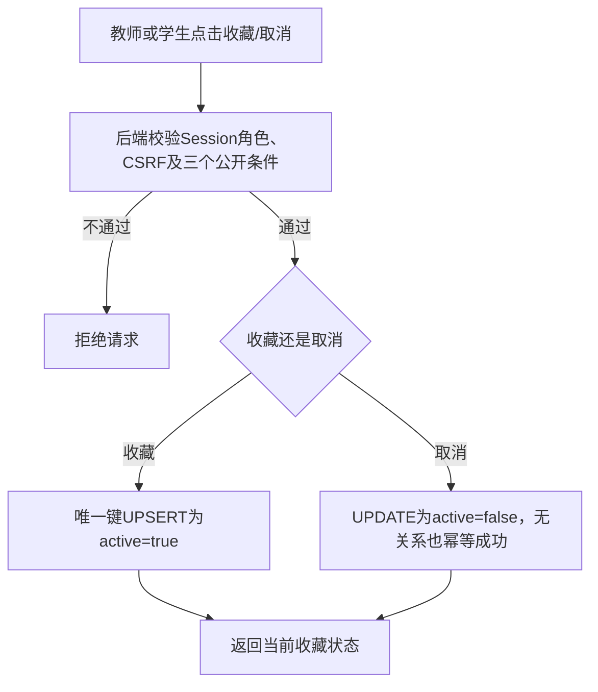
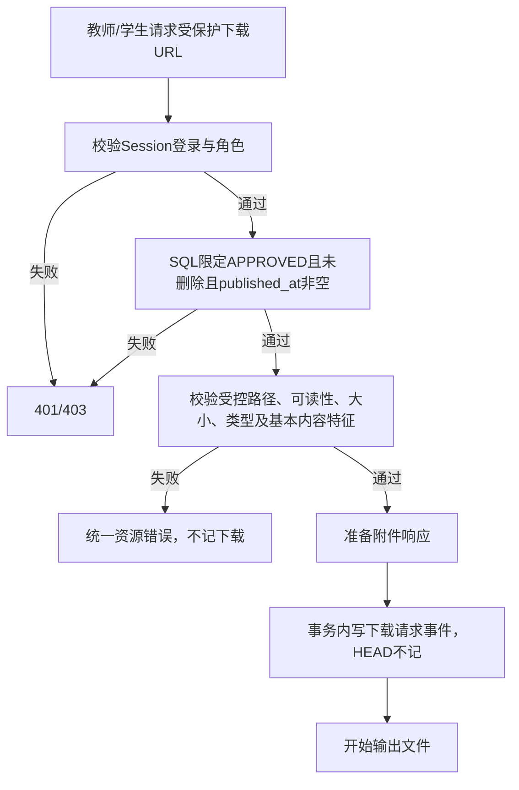
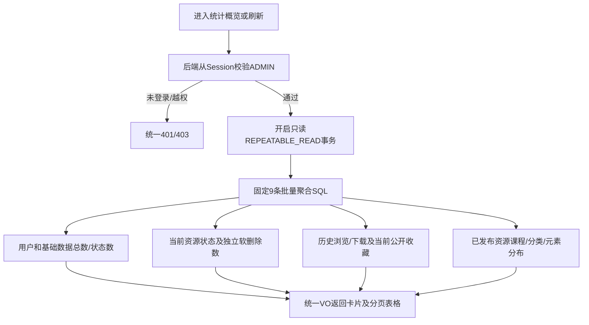

# 04 业务流程与关键时序

## 1. 资源生命周期

提交与审核属于状态转换，必须由后端在事务中校验。管理员通过时同时写审核记录、置为 `APPROVED` 并写 `published_at`；驳回时写审核原因并置为 `REJECTED`。教师本人草稿/驳回软删除只写 `deleted_at`，不物理清除审核历史；管理员下架、撤回及版本管理不在当前范围内。

`ARCHIVED` 只是图中的终止可见性节点，对应 `deleted_at IS NOT NULL`，不是资源审核状态枚举值。教师不得直接编辑待审核和已通过的资源。

第三阶段只实现 `DRAFT → DRAFT` 和 `DRAFT → ARCHIVED`，不实现提交或审核。草稿允许 0..N 个思政元素；将来 `DRAFT/REJECTED → PENDING` 时须至少 1 个有效元素，不能把该条件提前强加给草稿保存。

第四阶段已经实现DRAFT/REJECTED→PENDING以及PENDING→APPROVED/REJECTED；编辑驳回资源保持REJECTED。提交前锁定本人资源、重新验证元数据、启用课程/分类/全部元素与实际附件；成功提交才递增轮次。审核锁定资源，核对PENDING及页面轮次；过期页面/重复审核409。通过和驳回的历史/状态更新同事务，发布只发生在真正通过时。

### 审核关键时序（Mermaid）

## 2. 登录与权限判断

## 3. 检索与查看

## 4. 收藏

收藏表按 `(user_id, resource_id)` 唯一；取消收藏改变当前有效状态。统计“收藏量”只计有效收藏，避免重复收藏使计数膨胀。

第五阶段真实MySQL并发验证两次同时收藏均成功且最终一条关系。资源行先加共享锁保证本次可见性，不提前给收藏行加共享锁，避免UPSERT锁升级竞争。当前没有下架业务；我的收藏仍固定排除非公开/已软删除资源。

## 5. 下载

下载记录表示通过授权且文件已准备输出的请求，不推断用户是否完整保存了文件。预览同样经过权限和文件检查，但不计作下载。

第五阶段普通资源详情每次成功GET记一条事件，刷新可新增，不是UV。列表、预览、收藏/取消及管理员审核详情/附件不追加普通使用事件。详情/下载事件插入失败时事务回滚，不能只凭前端点击推断落库成功。

## 6. 管理员基础统计

统计只读、不新增使用事件；三个已发布条件与资源中心一致。零资源基础数据仍返回，停用不抹除历史分布。多元素关联不是互斥分类，事件数不是访问人数或教学效果。
