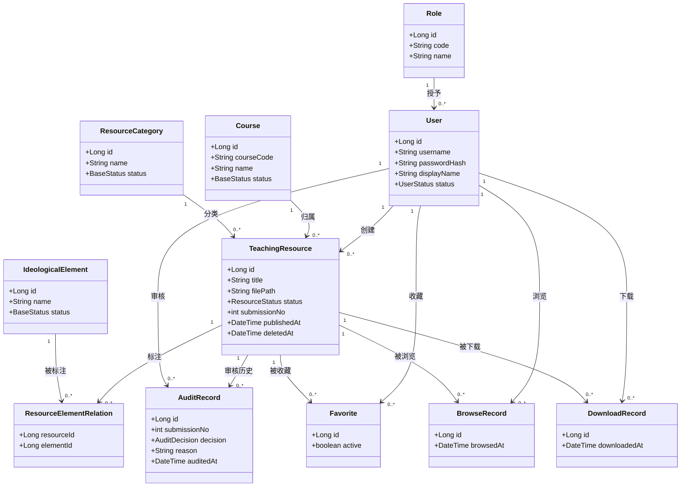

# 05 领域模型

学校建模指导要求先由用例识别实体及关系，再进入数据库设计。本模型只包含本项目实际需要持久化的对象。固定三种角色仍建 `Role` 表，原因是用户与角色的关联和权限矩阵需要可核验的数据来源；每位用户在本项目中只分配一个角色。`ResourceElementRelation` 明确承担资源与思政元素的多对多关联，避免在资源表内存逗号分隔 ID。

## 核心对象（11 个）

| 对象 | 主要职责 | 核心属性 | 主要关系 |
|---|---|---|---|
| `User` | 登录身份、资源创建、审核或使用行为的主体 | id、账号、密码散列、姓名、角色ID、状态、创建/更新时间 | 一个角色对应多个用户；一个教师创建多个资源；用户产生审核/收藏/浏览/下载记录 |
| `Role` | 固定角色标识与授权依据 | id、code、name | 一对多关联用户；仅 `ADMIN`、`TEACHER`、`STUDENT` |
| `Course` | 课程基本信息与资源归属 | id、编号、名称、简介、状态、创建/更新时间 | 一门课程对应多个资源；资源只能属于一门课程 |
| `IdeologicalElement` | 管理员维护的课程思政元素目录 | id、名称、说明、状态、创建/更新时间 | 经关联对象与多个资源形成多对多 |
| `ResourceCategory` | 资源分类目录 | id、名称、说明、状态、创建/更新时间 | 一个分类对应多个资源 |
| `TeachingResource` | 保存教学资源元数据、文件定位和审核状态 | id、标题、简介、课程ID、分类ID、创建教师ID、文件信息、状态、提交轮次、发布时间、软删除时间、创建/更新时间 | 归属一门课程、一个分类、一位教师；关联多个元素和审核/使用记录 |
| `ResourceElementRelation` | 保存资源与思政元素标注 | resourceId、elementId | 资源与元素多对多的连接实体 |
| `AuditRecord` | 不可修改的审核历史 | id、资源ID、提交轮次、审核员ID、原状态、结论、驳回原因、审核时间 | 一个资源有多条审核记录；一位管理员可审核多条资源 |
| `Favorite` | 当前收藏状态及收藏/取消时间 | id、用户ID、资源ID、有效状态、创建/更新时间 | 一个用户可收藏多个资源；同一用户对同一资源唯一 |
| `BrowseRecord` | 公开资源详情浏览事件 | id、用户ID、资源ID、浏览时间 | 用户和资源各对应多条浏览记录 |
| `DownloadRecord` | 获授权并开始输出的下载事件 | id、用户ID、资源ID、下载时间 | 用户和资源各对应多条下载记录 |

`ResourceCategory` 作为独立对象而非自由文本，是因为检索与分类统计需要稳定的分类口径。文件元数据放在 `TeachingResource`，当前一个资源只对应一个主要文件，因此不另建文件表。若后续业务变成多附件，必须先更新任务书/开题报告和本模型。

## 领域类图源码（Mermaid）

## 关键不变量

- `TeachingResource.courseId`、`categoryId`、`createdBy` 必须存在且非空；`createdBy` 对应教师角色。
- 新建与修改标注时只接受有效元素；已有历史标注不会因元素停用而被自动删除。
- `PENDING` 仅允许管理员作通过/驳回决策；审核记录与状态变更须原子提交。
- `APPROVED` 且 `deletedAt` 为空才是内部已发布资源；普通用户的检索、预览、下载和收藏都遵循同一判断。
- `AuditRecord` 保留提交轮次和审核时间，不允许更新或物理删除。
