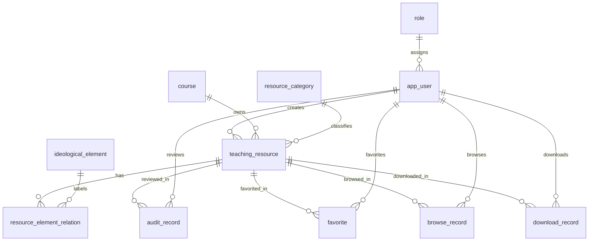

# 06 数据库概念与逻辑设计

## 1. 设计前提与 ER 确认

数据库采用 MySQL 8.0、`utf8mb4` 字符集和 InnoDB。需求基线要求三类角色、每资源一门课程、每资源多个思政元素、可追溯审核，以及收藏、浏览和下载等必要记录。下图的实体和关系与 [领域模型](05-领域模型.md) 一一对应；核对后没有为选课、成绩、考试、社交分享等业务建立表，因此据此进入逻辑表设计。

## 2. 通用约定

- `BIGINT UNSIGNED` 主键使用数据库自增。所有外键使用同一无符号类型。
- 业务时间为 `DATETIME(3)`，应用层按统一时区处理。`created_at` 默认当前时间，`updated_at` 默认当前时间并在更新时刷新。
- `status` 用 `VARCHAR` 加 `CHECK` 限定，不依赖数据库枚举类型，以便代码枚举与迁移脚本保持清楚。
- 所有外键采用 `ON DELETE RESTRICT`。用户、课程、元素、分类和资源以停用/软删除替代物理删除；审核历史及使用记录不删除。
- 浏览、下载记录保存事件发生时的用户和资源外键。收藏记录保存当前有效状态。统计查询不另建汇总表。
- 描述性统计采用 [需求分析](01-需求分析.md) 中确定的口径；历史浏览与下载事件不因资源后续下架而删除，当前资源/分类/元素/收藏统计则排除已下架资源。
- 资源文件保存在受控存储目录，数据库只存相对存储键及元数据；不得将用户提交的原始文件名直接拼成物理路径。
- 固定角色表不开放业务修改，故不设创建/更新时间；审核、浏览和下载是追加记录，使用各自事件时间而非可修改的 `updated_at`。

下表的“默认”中 `—` 表示没有数据库默认值，调用方必须提供或允许 NULL。除特别标注外，索引建议不改变唯一性约束。

## 3. 逻辑表结构（11 张）

### 3.1 `role`：固定角色

| 字段 | 类型 | 空值 | 默认 | 约束/说明 |
|---|---|---|---|---|
| `id` | BIGINT UNSIGNED | 否 | 自增 | 主键 |
| `code` | VARCHAR(20) | 否 | — | 唯一；`ADMIN`/`TEACHER`/`STUDENT` |
| `name` | VARCHAR(30) | 否 | — | 中文角色名 |

索引：主键 `PK(id)`、唯一 `UK(code)`。仅初始化三条固定数据；普通界面不提供角色新增或删除。

### 3.2 `app_user`：系统用户

| 字段 | 类型 | 空值 | 默认 | 约束/说明 |
|---|---|---|---|---|
| `id` | BIGINT UNSIGNED | 否 | 自增 | 主键 |
| `username` | VARCHAR(64) | 否 | — | 唯一登录账号 |
| `password_hash` | VARCHAR(255) | 否 | — | 安全散列，禁止明文 |
| `display_name` | VARCHAR(80) | 否 | — | 显示姓名 |
| `role_id` | BIGINT UNSIGNED | 否 | — | 外键→`role.id` |
| `status` | VARCHAR(16) | 否 | `ACTIVE` | `ACTIVE`/`DISABLED` |
| `created_at` | DATETIME(3) | 否 | CURRENT_TIMESTAMP(3) | 创建时间 |
| `updated_at` | DATETIME(3) | 否 | CURRENT_TIMESTAMP(3) | 更新时间 |

索引：主键；`UK(username)`；`IDX(role_id,status)`。删除策略：停用用户，保留教师创建资源、管理员审核和用户行为记录。

### 3.3 `course`：课程基本信息

| 字段 | 类型 | 空值 | 默认 | 约束/说明 |
|---|---|---|---|---|
| `id` | BIGINT UNSIGNED | 否 | 自增 | 主键 |
| `course_code` | VARCHAR(40) | 否 | — | 唯一课程编号 |
| `name` | VARCHAR(120) | 否 | — | 课程名称 |
| `description` | VARCHAR(1000) | 是 | NULL | 课程简介 |
| `status` | VARCHAR(16) | 否 | `ACTIVE` | `ACTIVE`/`INACTIVE` |
| `created_at` | DATETIME(3) | 否 | CURRENT_TIMESTAMP(3) | 创建时间 |
| `updated_at` | DATETIME(3) | 否 | CURRENT_TIMESTAMP(3) | 更新时间 |

索引：主键；`UK(course_code)`；`IDX(status,name)`。删除策略：停用，已有资源的课程关联保留。

### 3.4 `ideological_element`：课程思政元素

| 字段 | 类型 | 空值 | 默认 | 约束/说明 |
|---|---|---|---|---|
| `id` | BIGINT UNSIGNED | 否 | 自增 | 主键 |
| `name` | VARCHAR(100) | 否 | — | 唯一元素名称 |
| `description` | VARCHAR(1000) | 是 | NULL | 元素说明 |
| `status` | VARCHAR(16) | 否 | `ACTIVE` | `ACTIVE`/`INACTIVE` |
| `created_at` | DATETIME(3) | 否 | CURRENT_TIMESTAMP(3) | 创建时间 |
| `updated_at` | DATETIME(3) | 否 | CURRENT_TIMESTAMP(3) | 更新时间 |

索引：主键；`UK(name)`；`IDX(status,name)`。删除策略：停用，已有标注保留。

### 3.5 `resource_category`：资源分类

| 字段 | 类型 | 空值 | 默认 | 约束/说明 |
|---|---|---|---|---|
| `id` | BIGINT UNSIGNED | 否 | 自增 | 主键 |
| `name` | VARCHAR(80) | 否 | — | 唯一分类名称 |
| `description` | VARCHAR(1000) | 是 | NULL | 分类说明；第二阶段经确认补充 |
| `status` | VARCHAR(16) | 否 | `ACTIVE` | `ACTIVE`/`INACTIVE` |
| `created_at` | DATETIME(3) | 否 | CURRENT_TIMESTAMP(3) | 创建时间 |
| `updated_at` | DATETIME(3) | 否 | CURRENT_TIMESTAMP(3) | 更新时间 |

索引：主键；`UK(name)`；`IDX(status,name)`。删除策略：停用，已有资源分类归属保留。

第二阶段调整（2026-10-05）：仅为 `resource_category` 增加可空 `description` 字段，不改变主键、唯一约束、状态、索引或外键。已有数据库执行 `database/migrations/002-resource-category-description.sql`，新库使用更新后的 `schema.sql`；迁移允许重复执行，不删除已有记录。

### 3.6 `teaching_resource`：教学资源

| 字段 | 类型 | 空值 | 默认 | 约束/说明 |
|---|---|---|---|---|
| `id` | BIGINT UNSIGNED | 否 | 自增 | 主键 |
| `title` | VARCHAR(200) | 否 | — | 资源标题 |
| `description` | VARCHAR(2000) | 是 | NULL | 内容简介 |
| `course_id` | BIGINT UNSIGNED | 否 | — | 外键→`course.id`；一资源一课程 |
| `category_id` | BIGINT UNSIGNED | 否 | — | 外键→`resource_category.id` |
| `created_by` | BIGINT UNSIGNED | 否 | — | 外键→`app_user.id`；服务层限制为教师 |
| `file_storage_key` | VARCHAR(500) | 否 | — | 服务端生成的相对存储键 |
| `file_original_name` | VARCHAR(255) | 否 | — | 显示/下载文件名 |
| `file_mime_type` | VARCHAR(120) | 否 | — | 实际识别的内容类型 |
| `file_size_bytes` | BIGINT UNSIGNED | 否 | — | 大于 0；最大值由配置控制 |
| `status` | VARCHAR(16) | 否 | `DRAFT` | `DRAFT`/`PENDING`/`APPROVED`/`REJECTED` |
| `submission_no` | INT UNSIGNED | 否 | 0 | 每成功提交事务递增1；编辑、查看、审核不递增 |
| `published_at` | DATETIME(3) | 是 | NULL | 审核通过时写入；其余状态为空 |
| `deleted_at` | DATETIME(3) | 是 | NULL | 软删除/下架标记 |
| `created_at` | DATETIME(3) | 否 | CURRENT_TIMESTAMP(3) | 创建时间 |
| `updated_at` | DATETIME(3) | 否 | CURRENT_TIMESTAMP(3) | 更新时间 |

索引：主键；`IDX(created_by,status,deleted_at)`；`IDX(status,deleted_at,course_id,category_id)`；`IDX(title)`；`IDX(created_at)`；现有单列 `IDX(course_id)`、`IDX(category_id)`。元素筛选走关联表索引。检索使用参数化普通 SQL 及转义 `LIKE`；不引入 Elasticsearch。公开查询必须固定附加 `status='APPROVED' AND deleted_at IS NULL AND published_at IS NOT NULL`。`file_storage_key` 由服务端生成并控制唯一性，不作为公开VO字段。删除策略：软删除，外键与审核历史保留；第五阶段不实现管理员下架。

### 3.7 `resource_element_relation`：资源与元素关联

| 字段 | 类型 | 空值 | 默认 | 约束/说明 |
|---|---|---|---|---|
| `resource_id` | BIGINT UNSIGNED | 否 | — | 外键→`teaching_resource.id`；联合主键 |
| `element_id` | BIGINT UNSIGNED | 否 | — | 外键→`ideological_element.id`；联合主键 |
| `created_at` | DATETIME(3) | 否 | CURRENT_TIMESTAMP(3) | 标注时间 |

索引：`PK(resource_id,element_id)`；`IDX(element_id,resource_id)`。删除策略：资源编辑时可在同一事务内调整关联；资源软删除时不清除历史标注。

第三阶段确认（2026-10-05）：`DRAFT` 允许关联表中存在 0..N 条记录；提交审核时至少 1 个有效元素属于第四阶段服务层校验，不新增数据库字段或修改关联表约束。本阶段只管理教师本人未删除的 `DRAFT`，创建者由 Session 决定。

### 3.8 `audit_record`：审核历史

| 字段 | 类型 | 空值 | 默认 | 约束/说明 |
|---|---|---|---|---|
| `id` | BIGINT UNSIGNED | 否 | 自增 | 主键 |
| `resource_id` | BIGINT UNSIGNED | 否 | — | 外键→`teaching_resource.id` |
| `submission_no` | INT UNSIGNED | 否 | — | 对应资源提交轮次，≥1 |
| `reviewer_id` | BIGINT UNSIGNED | 否 | — | 外键→`app_user.id`；服务层限制为管理员 |
| `from_status` | VARCHAR(16) | 否 | `PENDING` | 审核前状态，固定 `PENDING` |
| `decision` | VARCHAR(16) | 否 | — | `APPROVE`/`REJECT` |
| `reason` | VARCHAR(1000) | 是 | NULL | 驳回时必填非空白 |
| `audited_at` | DATETIME(3) | 否 | CURRENT_TIMESTAMP(3) | 审核时间 |

索引：主键；`UK(resource_id,submission_no)` 防止同一轮重复审核；`IDX(reviewer_id,audited_at)`；`IDX(resource_id,audited_at)`。审核与资源状态在同一事务完成。记录不可更新或物理删除。

### 3.9 `favorite`：当前收藏状态

| 字段 | 类型 | 空值 | 默认 | 约束/说明 |
|---|---|---|---|---|
| `id` | BIGINT UNSIGNED | 否 | 自增 | 主键 |
| `user_id` | BIGINT UNSIGNED | 否 | — | 外键→`app_user.id`；教师/学生 |
| `resource_id` | BIGINT UNSIGNED | 否 | — | 外键→`teaching_resource.id` |
| `active` | BOOLEAN | 否 | TRUE | 是否当前收藏 |
| `created_at` | DATETIME(3) | 否 | CURRENT_TIMESTAMP(3) | 首次收藏时间 |
| `updated_at` | DATETIME(3) | 否 | CURRENT_TIMESTAMP(3) | 最近实际状态变化时间；幂等无变化不承诺刷新 |

索引：主键；`UK(user_id,resource_id)`；`IDX(resource_id,active)`。收藏UPSERT为TRUE、取消只UPDATE为FALSE，不物理删除；无记录取消也幂等成功。我的收藏限定Session用户、active=TRUE及资源三个公开条件，不新增日志表。

### 3.10 `browse_record`：浏览记录

| 字段 | 类型 | 空值 | 默认 | 约束/说明 |
|---|---|---|---|---|
| `id` | BIGINT UNSIGNED | 否 | 自增 | 主键 |
| `user_id` | BIGINT UNSIGNED | 否 | — | 外键→`app_user.id` |
| `resource_id` | BIGINT UNSIGNED | 否 | — | 外键→`teaching_resource.id` |
| `browsed_at` | DATETIME(3) | 否 | CURRENT_TIMESTAMP(3) | 后端成功处理普通详情GET的事件时间 |

索引：主键；`IDX(user_id,browsed_at)`；`IDX(resource_id,browsed_at)`。每次成功打开/刷新普通详情一条，HEAD、列表、预览、收藏及管理员审核不记；不承诺前端完整展示确认，不代表独立人数。事件user_id来自Session，事务失败回滚。

### 3.11 `download_record`：下载记录

| 字段 | 类型 | 空值 | 默认 | 约束/说明 |
|---|---|---|---|---|
| `id` | BIGINT UNSIGNED | 否 | 自增 | 主键 |
| `user_id` | BIGINT UNSIGNED | 否 | — | 外键→`app_user.id` |
| `resource_id` | BIGINT UNSIGNED | 否 | — | 外键→`teaching_resource.id` |
| `downloaded_at` | DATETIME(3) | 否 | CURRENT_TIMESTAMP(3) | 授权和文件校验通过、准备正常响应的请求事件时间 |

索引：主键；`IDX(user_id,downloaded_at)`；`IDX(resource_id,downloaded_at)`。传输完成与否不由此表推断。

第五阶段明确：每次有效GET下载请求可追加一条，HEAD、普通预览和管理员审核附件读取不记；401/403/404、实际缺文件或校验失败不记。user_id取Session，事件写入失败时回滚，不将点击或浏览器工具超时当作成功落库证明。

## 4. 状态约束与事务边界

| 对象 | 允许值 | 关键约束 |
|---|---|---|
| 用户 | `ACTIVE`、`DISABLED` | 停用后不能登录 |
| 课程/元素/分类 | `ACTIVE`、`INACTIVE` | 停用后不能用于新资源或新标注 |
| 资源 | `DRAFT`、`PENDING`、`APPROVED`、`REJECTED` | 仅按状态图转换；`APPROVED` 必须有发布时间 |
| 审核 | `APPROVE`、`REJECT` | 每提交轮次只一条结果；驳回原因必填 |

审核事务顺序：锁定资源行→验证PENDING及请求所见轮次→确认附件可读→追加审核记录→改资源状态/发布时间→提交事务。提交/重新提交事务顺序：锁定本人资源→验证草稿/驳回状态及内容→递增轮次并置待审核→提交。第四阶段已经实现并进行真实MySQL并发/回滚验证，详见docs/13。

第四阶段数据库核验（2026-10-05）：本机teaching_resource、resource_element_relation和audit_record与schema一致，新增表0、新增字段0、迁移0。沿用reviewer_id（等价审核人字段）、同轮唯一键与RESTRICT外键。PENDING期间教师内容被冻结，API仅在此状态将updated_at输出为pendingSubmittedAt，审核后置空该展示字段；并未增加submitted_at，也不把审核后的updated_at当提交时间。审核历史是追加结论，不是各轮文件版本备份。DRAFT/REJECTED删除仍为软删除，保留审核历史与当前附件。

第五阶段核验（2026-10-05）：实际MySQL 8.0.39仍11张表，favorite/browse_record/download_record结构与schema一致，表/字段/索引/迁移新增均0。公开分页为COUNT、元数据/收藏JOIN、元素IN批量读取，非空页固定3次查询，不逐资源查询元素。实测EXPLAIN无筛选与课程/分类/元素组合查询均使用idx_resource_public，收藏JOIN使用uk_favorite_user_resource，关联使用联合主键；published_at DESC,id DESC排序出现filesort。当前小规模验证未提供性能瓶颈证据，因此没有增加排序索引；前导通配LIKE不宣称由title索引加速。未来规模变化时先测再调整。
