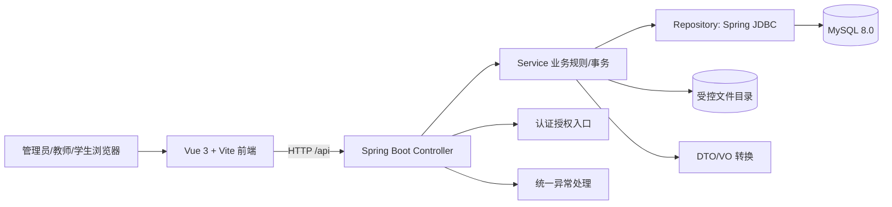

# 07 系统总体架构与技术选型

## 1. 技术基线

本机检查于 2026-10-04：JDK 21.0.11、Maven 3.9.9、Node.js 22.14.0、pnpm 11.25.0、MySQL Server 8.0.39（`MySQL80` 服务运行）、Git 2.53.0。项目选用 Java 21、Spring Boot 3.5.7、Vue 3.5.13、Vite 6.3.5、MySQL 8.0.39；Spring Boot 管理后端依赖版本。Node 与 pnpm 是开发工具，不参与后端运行。版本选择以当前环境兼容和本科项目可维护性为准，升级需要单独验证。

| 技术 | 用途与理由 | 本轮引入情况 |
|---|---|---|
| Spring Boot Web | 提供 REST 接口与统一异常入口，环境已有 Maven 缓存 | 骨架引入 |
| Spring JDBC | 用少量依赖完成显式 SQL 访问，便于核对数据库设计与状态条件 | 骨架引入，只执行连接检查 |
| MySQL Connector/J | 连接已有 MySQL 8.0 服务 | 骨架引入 |
| Spring Security | 后续实现身份认证、密码散列和接口授权，避免自写安全机制 | 设计采用，骨架暂不实现登录 |
| Vue 3 + Vite | 简明的组件/路由基础与开发服务器，适合前后端分离 | 骨架引入 |
| 原生 `fetch` | 完成骨架一次 API 通信，现阶段无需额外 HTTP 客户端 | 骨架采用 |
| UI 组件库 | 管理表单/表格开发时可选 Element Plus；当前骨架不需要 | 暂不引入 |

不引入 ORM/MyBatis 是本轮有意的简化：核心数据库关系、审核事务和可见性条件以显式 SQL 表达。若后续发现查询维护成本明显增加，再结合实际实现决定是否引入数据访问框架，不因“技术栈完整”而提前增加依赖。

## 2. 总体结构

后端是单体 Web 应用。数据库保存结构化业务数据和资源文件的相对存储键；上传文件保存在服务端受控目录。前端只通过后端接口取得资源，不直接访问数据库或存储目录。

## 3. 后端分层

| 层/组件 | 责任 | 禁止事项 |
|---|---|---|
| `Controller` | 接收 HTTP 请求、参数校验、返回统一响应 | 不写核心状态转换或 SQL |
| `Service` | 业务规则、角色/归属/状态校验、事务边界 | 不依赖前端按钮显隐决定权限 |
| `Repository` | 使用 Spring JDBC 执行参数化 SQL、映射查询结果 | 不拼接不可信 SQL 条件 |
| `Entity/DO` | 表结构与持久化对象 | 不作为公开 API 响应直接输出密码散列/存储路径 |
| `DTO` | 输入参数及校验规则 | 不接受客户端指定创建者/审核者身份 |
| `VO` | 对外展示所需字段 | 不包含内部文件绝对路径 |
| `Security` | 登录凭据、密码散列、角色和接口授权 | 不只在前端进行权限判断 |
| `ExceptionHandler` | 统一业务错误和意外异常响应 | 不把堆栈和数据库语句返回浏览器 |
| `FileStorage` | 文件类型/大小检查、路径生成、保存、预览与下载 | 不直接使用用户文件名作为路径 |

建议包结构：`common`、`config`、`auth`、`user`、`course`、`element`、`category`、`resource`、`audit`、`interaction`、`statistics`。骨架只创建 `common`、`config`、`system` 等最小包，其余包随业务模块逐步落实。

## 4. 前端结构

| 部分 | 责任 |
|---|---|
| 登录页 | 收集凭据、处理认证错误、建立前端会话视图 |
| 布局 | 统一导航、角色入口、状态反馈 |
| 路由 | 按登录状态和角色决定页面入口；最终权限仍以后端为准 |
| 权限菜单 | 根据后端身份信息显示管理员、教师、学生可用菜单 |
| API 封装 | 统一地址、身份凭据、错误处理和响应解包 |
| 管理员页面 | 用户、课程、元素、分类、待审资源、已发布资源和统计 |
| 教师页面 | 本人资源建设与审核进度、已发布资源检索/使用 |
| 学生页面 | 已发布资源检索、详情、预览、下载和收藏 |

骨架阶段只提供首页和基础通信状态展示；上述业务页面是设计，不宣称已实现。

## 5. 接口与错误约定

统一响应结构：`{ "code": "OK", "message": "success", "data": ... }`。业务错误使用稳定错误码和适当 HTTP 状态，例如认证失败 `401`、越权 `403`、资源不存在/不可见 `404`、状态冲突 `409`、参数错误 `400`；意外异常 `500` 不泄漏堆栈。骨架接口 `GET /api/system/ping` 用于验证前端→后端→MySQL 的最短链路，响应只暴露连接是否成功，不返回数据库账号或服务器细节。

预计的业务路径为 `/api/auth`、`/api/users`、`/api/courses`、`/api/elements`、`/api/categories`、`/api/resources`、`/api/audits`、`/api/favorites`、`/api/statistics`。这些路径在本轮仅作为模块边界说明，不代表接口已经实现。

## 6. 部署与配置

开发时 Vite 代理 `/api` 到本地 Spring Boot，避免业务代码硬编码后端地址。MySQL 地址、数据库名、用户、密码由环境变量提供；仓库仅保存示例配置。文件目录使用项目专属路径并受后端控制。正式部署前需补充数据库备份、文件备份、HTTPS、权限配置和可重复启动说明；本轮只验证本机骨架。

## 7. 第二阶段实现同步（2026-10-05）

以上“骨架引入情况”是初始设计阶段记录，不表示当前仍未实现认证。第一阶段采用 Spring Security Session、HttpOnly Cookie、CSRF 和 BCrypt，详见 docs/10；第二阶段不更换该架构。

课程、思政元素、分类的结构相近，实际使用 `basedata` 包的 Controller、Service、Spring JDBC Repository 和 DTO/VO 复用管理逻辑。对象仍分别落在既有三张表，不合并业务实体或增加通用元数据表；SQL 表名/列名只从固定枚举获取，请求值全部参数绑定。

实际路径采用 `/api/courses`、`/api/ideological-elements`、`/api/resource-categories`，后两者替代初期暂定的 `/api/elements`、`/api/categories`，不保留多套别名。管理接口在 URL 与方法级限制 ADMIN；`/api/options/` 下的对应三个接口仅返回 ACTIVE 选项，供三类已登录角色读取。前端三个管理路由共用一个配置化页面，角色守卫不变，菜单只对管理员开放。

默认连接库名与本机确认值统一为 `management-system`；环境变量和不受跟踪的本地配置仍可覆盖。第二阶段不实现文件、教学资源、审核、收藏、使用记录或统计业务，目录设计中的这些组件仍属于后续计划。

## 8. 第三阶段实现同步（2026-10-05）

新增 `resource` 包，沿用 Spring JDBC、Session、CSRF 和统一响应；实际草稿路径为 `/api/teacher/resources`，只允许 TEACHER 管理本人 DRAFT。资源与标注修改使用同一数据库事务；服务器本地文件存储通过事务完成回调处理回滚清理与提交后旧文件清理。删除是保留当前文件和标注的软删除。

上传目录 `app.resource-storage.directory` 可由 `RESOURCE_STORAGE_DIR` 配置（默认 backend 工作目录下 `uploads/resources`），仅存 UUID 相对键，未作为静态目录公开。单文件上限 20 MiB，文档/图片白名单集中配置；前端 multipart 使用原 CSRF 机制，不手动设置 boundary。草稿允许 0..N 个有效元素；至少 1 个有效元素的提交规则留待第四阶段，不在本阶段实现审核/发布/下载接口。

## 9. 第四阶段实现同步（2026-10-05）

保持Session/HttpOnly/CSRF/BCrypt及Spring JDBC不变。resource包增加ResourceReviewController/Service、AuditRecordRepository及历史VO；ResourceDraftService扩展本人四状态读取、驳回编辑与提交。URL和方法级控制ADMIN审核入口，服务层核对身份、行锁、轮次；SQL仍参数化，无Redis/JWT或第二套审核表。附件定位键仅内部使用。

实际新增路径：POST /api/teacher/resources/{id}/submit；GET /api/admin/resource-reviews及/{id}、/{id}/attachment；POST /{id}/approve和/{id}/reject。审核写请求携带submissionNo，驳回另含reason。附件只返回获授权且校验后的当前文件字节，不记录普通下载。后端仍保留默认DENY framing头，前端经原API封装读取Blob后显示；PDF.js固定4.10.38，仅在管理员PDF预览时懒加载，使用本地构建worker，不发往第三方文档服务。图片在本地Blob显示，Office下载查看。

前端新增/resource-reviews及/:id两条ADMIN路由；教师原四路由按状态显示操作，提交和审核均使用页面内确认。学生资源中心、公开搜索、收藏、浏览/下载记录、统计和已发布资源改版仍未开发。

## 10. 第五阶段实现同步（2026-10-05）

保持Session、HttpOnly、CSRF、BCrypt、Spring JDBC及所有技术版本不变。resource包新增PublishedResourceController/Service/Repository及独立公开VO，复用已有文件核验与批量元素映射，不新建表、统计缓存或第二套文件存储。Controller、SecurityConfig和服务层限制TEACHER/STUDENT；普通查询在SQL固定APPROVED、未删除及发布时间非空。

实际路径为GET /api/resources、/{id}、/{id}/preview、/{id}/download，POST/DELETE /api/resources/{id}/favorite，GET /api/favorites。普通单资源访问先FOR SHARE锁定可见资源行，不共享锁收藏行；收藏唯一键UPSERT避免重复。浏览/下载事件与业务检查处于同一数据库事务，userId由Session提供。公开VO排除存储路径与审核内部字段。

前端新增/resources、/resources/:id、/favorites，只开放教师/学生菜单与角色路由。资源列表和收藏页复用PublishedResourceListView；详情页收藏更新本地状态，不重请求详情。PDF复用PDF.js 4.10.38的懒加载组件及本地worker，图片使用授权Blob，组件卸载释放URL。Office不在线转换，显示下载提示；下载通过同源受保护链接使用Session Cookie，不公开目录、不把文档发给第三方。保留nosniff、no-store、CSP sandbox与默认DENY framing安全头。

管理员审核页面和教师本人生命周期入口保持独立；普通预览/管理员读取不记浏览或下载，HEAD不记详情/下载事件。当前未实现统计、发布后编辑、撤回、下架或版本管理。实际验证与已知限制见docs/14。

## 11. 第六阶段实现同步

新增statistics包：StatisticsController/Service/Repository及只读StatisticsOverview VO，GET /api/admin/statistics/overview仅ADMIN。认证仍是Session、HttpOnly、CSRF和BCrypt，技术依赖版本不变。Service使用只读REPEATABLE_READ事务；Repository固定9条聚合SQL，无N+1、统计缓存或新表。前端新增/statistics、StatisticsView、DistributionTable和统一API封装；使用已有卡片/表格样式，不引入图表库，分布表前端每页10项。

统计口径、三角色联调、真实构建、HTTP及数据库/文件核验见docs/15。旧章节中的“尚未实现”是对应阶段历史；本阶段只落实基础统计并做系统回归。发布后编辑、撤回、下架、版本管理、趋势预测及推荐仍不在当前范围内。
