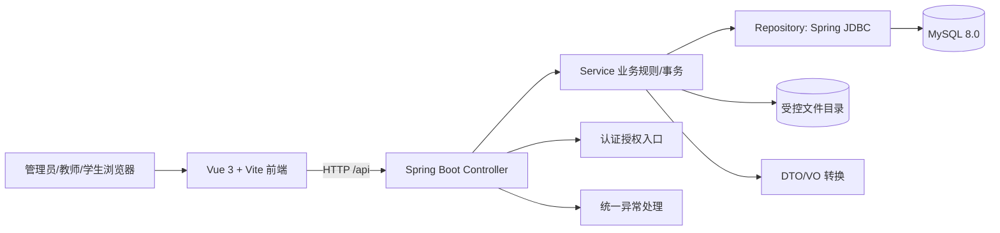

# 07 系统总体架构与技术选型

## 1. 技术基线

本机检查于 2026-10-04：JDK 21.0.11、Maven 3.9.9、Node.js 22.14.0、pnpm 11.25.0、MySQL Server 8.0.39（`MySQL80` 服务运行）、Git 2.53.0。项目选用 Java 21、Spring Boot 3.5.7、Vue 3.5.13、Vite 6.3.5、MySQL 8.0.39；Spring Boot 管理后端依赖版本。Node 与 pnpm 是开发工具，不参与后端运行。版本选择以当前环境兼容和本科项目可维护性为准，升级需要单独验证。

| 技术 | 用途与理由 | 本轮引入情况 |
|---|---|---|
| Spring Boot Web | 提供 REST 接口与统一异常入口，环境已有 Maven 缓存 | 骨架引入 |
| Spring JDBC | 用少量依赖完成显式 SQL 访问，便于核对数据库设计与状态条件 | 骨架引入，只执行连接检查 |
| MySQL Connector/J | 连接已有 MySQL 8.0 服务 | 骨架引入 |
| Spring Security | 后续实现身份认证、密码散列和接口授权，避免自写安全机制 | 设计采用，骨架暂不实现登录 |
| Vue 3 + Vite | 简明的组件/路由基础与开发服务器，适合前后端分离 | 骨架引入 |
| 原生 `fetch` | 完成骨架一次 API 通信，现阶段无需额外 HTTP 客户端 | 骨架采用 |
| UI 组件库 | 管理表单/表格开发时可选 Element Plus；当前骨架不需要 | 暂不引入 |

不引入 ORM/MyBatis 是本轮有意的简化：核心数据库关系、审核事务和可见性条件以显式 SQL 表达。若后续发现查询维护成本明显增加，再结合实际实现决定是否引入数据访问框架，不因“技术栈完整”而提前增加依赖。

## 2. 总体结构

后端是单体 Web 应用。数据库保存结构化业务数据和资源文件的相对存储键；上传文件保存在服务端受控目录。前端只通过后端接口取得资源，不直接访问数据库或存储目录。

## 3. 后端分层

| 层/组件 | 责任 | 禁止事项 |
|---|---|---|
| `Controller` | 接收 HTTP 请求、参数校验、返回统一响应 | 不写核心状态转换或 SQL |
| `Service` | 业务规则、角色/归属/状态校验、事务边界 | 不依赖前端按钮显隐决定权限 |
| `Repository` | 使用 Spring JDBC 执行参数化 SQL、映射查询结果 | 不拼接不可信 SQL 条件 |
| `Entity/DO` | 表结构与持久化对象 | 不作为公开 API 响应直接输出密码散列/存储路径 |
| `DTO` | 输入参数及校验规则 | 不接受客户端指定创建者/审核者身份 |
| `VO` | 对外展示所需字段 | 不包含内部文件绝对路径 |
| `Security` | 登录凭据、密码散列、角色和接口授权 | 不只在前端进行权限判断 |
| `ExceptionHandler` | 统一业务错误和意外异常响应 | 不把堆栈和数据库语句返回浏览器 |
| `FileStorage` | 文件类型/大小检查、路径生成、保存、预览与下载 | 不直接使用用户文件名作为路径 |

建议包结构：`common`、`config`、`auth`、`user`、`course`、`element`、`category`、`resource`、`audit`、`interaction`、`statistics`。骨架只创建 `common`、`config`、`system` 等最小包，其余包随业务模块逐步落实。

## 4. 前端结构

| 部分 | 责任 |
|---|---|
| 登录页 | 收集凭据、处理认证错误、建立前端会话视图 |
| 布局 | 统一导航、角色入口、状态反馈 |
| 路由 | 按登录状态和角色决定页面入口；最终权限仍以后端为准 |
| 权限菜单 | 根据后端身份信息显示管理员、教师、学生可用菜单 |
| API 封装 | 统一地址、身份凭据、错误处理和响应解包 |
| 管理员页面 | 用户、课程、元素、分类、待审资源、已发布资源和统计 |
| 教师页面 | 本人资源建设与审核进度、已发布资源检索/使用 |
| 学生页面 | 已发布资源检索、详情、预览、下载和收藏 |

骨架阶段只提供首页和基础通信状态展示；上述业务页面是设计，不宣称已实现。

## 5. 接口与错误约定

统一响应结构：`{ "code": "OK", "message": "success", "data": ... }`。业务错误使用稳定错误码和适当 HTTP 状态，例如认证失败 `401`、越权 `403`、资源不存在/不可见 `404`、状态冲突 `409`、参数错误 `400`；意外异常 `500` 不泄漏堆栈。骨架接口 `GET /api/system/ping` 用于验证前端→后端→MySQL 的最短链路，响应只暴露连接是否成功，不返回数据库账号或服务器细节。

预计的业务路径为 `/api/auth`、`/api/users`、`/api/courses`、`/api/elements`、`/api/categories`、`/api/resources`、`/api/audits`、`/api/favorites`、`/api/statistics`。这些路径在本轮仅作为模块边界说明，不代表接口已经实现。

## 6. 部署与配置

开发时 Vite 代理 `/api` 到本地 Spring Boot，避免业务代码硬编码后端地址。MySQL 地址、数据库名、用户、密码由环境变量提供；仓库仅保存示例配置。文件目录使用项目专属路径并受后端控制。正式部署前需补充数据库备份、文件备份、HTTPS、权限配置和可重复启动说明；本轮只验证本机骨架。
