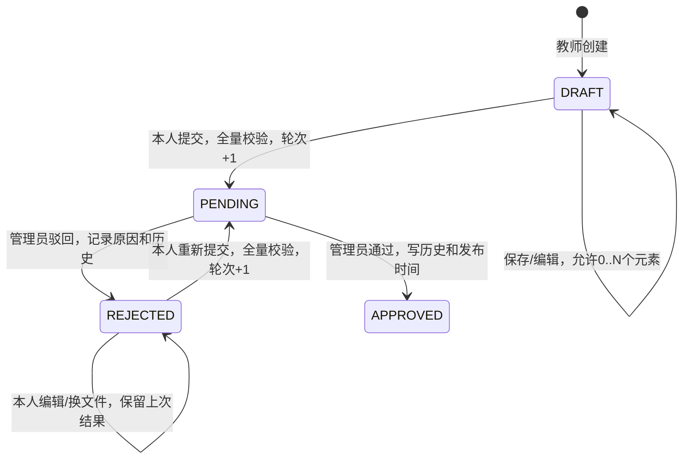

# 13 教学资源审核与发布实现记录

验证日期：2026-10-05。第三阶段稳定基线：`77f39cb4dbaefbac74c784bbe422021f1395fe5e`。

本记录只描述第四阶段实际实现及本机测试，不代表完整系统或生产部署验收。已确认的任务书、开题报告及用户自行修改的 Word 材料均未由本阶段改写。

## 1. 实现范围与技术基线

本阶段完成教师提交审核、管理员审核、驳回编辑与重新提交、首次审核发布、审核历史及受权限保护的审核附件读取。未开发学生资源中心、公共资源检索、普通资源预览/下载、收藏、浏览/下载记录、统计或已发布版本修改。

保持 JDK 21.0.11、Maven 3.9.9、Spring Boot 3.5.7、Spring Security 6.5.6、Spring JDBC、MySQL 8.0.39、Connector/J 9.4.0、Vue 3.5.13、Vue Router 4.5.1、Vite 6.3.5、Node.js 22.14.0、pnpm 11.25.0。认证仍为 Session、HttpOnly Cookie、CSRF 和 BCrypt(12)，没有改为 JWT，也未增加 Redis、Elasticsearch、消息队列或 AI 组件。

新增前端依赖 `pdfjs-dist`，固定版本 `4.10.38`，仅用于管理员查看审核 PDF；懒加载页面组件和本地 worker，不上传材料到第三方，不关闭后端安全响应头。

## 2. 状态机及操作边界

不新增 `PENDING_REVIEW`。普通创建/编辑 DTO 不接收 `status`、创建人、审核人或服务器存储路径；状态只能通过专门业务动作变化。

| 当前状态 | 教师本人读取 | 编辑/换文件 | 软删除 | 提交/重提 | 管理员详情/历史/附件 | 管理员作决定 |
|---|---|---|---|---|---|---|
| DRAFT | 允许 | 允许 | 允许 | 校验后允许 | 不允许，返回404 | 不允许，返回409 |
| PENDING | 允许 | 409 | 409 | 409 | 允许 | 当前轮次匹配时允许 |
| REJECTED | 允许，含原因和历史 | 允许，仍为REJECTED | 允许，保留历史和当前文件 | 校验后允许 | 允许 | 409 |
| APPROVED | 允许，含历史和发布时间 | 409 | 409 | 409 | 允许 | 409 |

管理员读取范围已由用户明确确认：允许追溯已提交的三种状态，但不能看从未提交的草稿或冒充教师编辑正文。其他教师访问非本人专属资源返回404；学生不能进入审核管理或使用教师资源接口。已软删除资源不出现在上述业务读取中。

## 3. submission_no 与时间口径

- 新资源 `submission_no=0`。
- 每一次成功提交事务递增1：首次提交为1，驳回后重新提交为2，以此类推。
- 保存、编辑、换文件、管理员查看以及审核决定均不增加轮次；失败事务不增加轮次。
- 后端使用 `long` 表达既有 `INT UNSIGNED`，达到4294967295时拒绝再次递增。
- 审核请求必须携带页面所见 `submissionNo`。缺少或非法轮次返回400；旧轮次页面试图处理新一轮待审核资源返回409，不能误审新内容。
- `published_at` 只在真正审核通过事务中赋值；草稿、待审核及驳回均为空。
- 未增加 `submitted_at`。仅在 PENDING 内容冻结期间，将最后状态更新时间 `updated_at` 展示为 `pendingSubmittedAt`；审核后该展示字段为空，不把审核后的更新时间当作历史提交时间。

## 4. 真实数据库结构与变化

核验数据库为本机 `127.0.0.1:3306` 的 `management-system`，服务版本8.0.39。仍为11张表；本阶段新增表0、字段0、迁移0，`database/schema.sql` 未改动。

沿用 `teaching_resource.submission_no`、`published_at`、`deleted_at` 和 `resource_element_relation`，没有再建一套审核表。

`audit_record` 的实际字段如下：

| 字段 | 实际类型/约束 | 用途 |
|---|---|---|
| id | BIGINT UNSIGNED，主键自增 | 审核记录标识 |
| resource_id | BIGINT UNSIGNED，非空，外键RESTRICT | 被审核资源 |
| submission_no | INT UNSIGNED，非空，>0 | 审核所属提交轮次 |
| reviewer_id | BIGINT UNSIGNED，非空，外键RESTRICT | 审核管理员；等价于需求中的auditor_id |
| from_status | VARCHAR(16)，非空，默认且限定PENDING | 审核前状态 |
| decision | VARCHAR(16)，限定APPROVE/REJECT | 通过或驳回 |
| reason | VARCHAR(1000)，可空 | 驳回须非空白；通过为NULL |
| audited_at | DATETIME(3)，默认CURRENT_TIMESTAMP(3) | 审核时间 |

已有 `uk_audit_round(resource_id,submission_no)`，同资源同轮只能一条结论；另有审核人/时间和资源/时间索引。代码只提供追加与查询，不提供审核记录更新/删除。

历史能追溯轮次、决定、人员、原因和时间，**不是每轮文件或元数据快照**。驳回换文件仍沿用第三阶段“事务成功后清理旧文件”的策略；软删除保留资源行、审核历史、当前关联和当前文件。

## 5. 新增接口与响应

| 方法与URI | 请求及作用 | 权限 |
|---|---|---|
| POST /api/teacher/resources/{id}/submit | 无需status参数；本人草稿/驳回全量校验后提交 | TEACHER，需CSRF |
| GET /api/admin/resource-reviews | 默认PENDING；keyword/courseId/categoryId/teacherId/status/page/size | ADMIN |
| GET /api/admin/resource-reviews/{id} | 已提交资源详情、文件元数据及审核历史 | ADMIN |
| GET /api/admin/resource-reviews/{id}/attachment | 读取当前审核材料；download=true强制下载 | ADMIN |
| POST /api/admin/resource-reviews/{id}/approve | JSON：`{"submissionNo":1}`，通过并发布 | ADMIN，需CSRF |
| POST /api/admin/resource-reviews/{id}/reject | JSON：`{"submissionNo":1,"reason":"请完善案例说明"}` | ADMIN，需CSRF |

审核列表支持 PENDING/REJECTED/APPROVED/ALL，ALL仍不含草稿。关键词按标题进行转义LIKE查询，ID、状态、分页与词长校验；不引入复杂检索。前端课程/分类选择器复用已有ACTIVE options，历史条目仍可从“全部”查询及详情追溯。

沿用教师资源已有列表、详情、编辑及软删除接口，扩展四状态读取、驳回编辑和审核历史。统一JSON响应及400/401/403/404/409错误机制不变；附件成功响应为二进制，失败仍走统一错误处理。

## 6. 提交、审核与附件校验

提交事务重新检查本人归属、未软删除、DRAFT/REJECTED、标题、课程ACTIVE、分类ACTIVE、至少1个元素且全部ACTIVE，以及实际文件；不因以前保存过就跳过校验。基础数据行使用FOR SHARE，防止校验与管理员停用相互穿越。

文件核验沿用单文件20 MiB与既有白名单，并检查服务器平面UUID键、原始名称、扩展名/MIME/大小一致性、文件存在及可读、非符号链接、真实路径仍在受控目录，以及基本签名/Office容器结构。缺文件或损坏材料不能提交/审核通过，返回明确400而非泄漏服务器路径。

审核驳回原因由后端strip并校验非空白、长度不超过1000；前端提示不代替后端校验。通过不写虚构意见。

管理员附件读取在资源锁内取得经过校验的有界字节，避免驳回换文件与读取竞争；目录不公开。响应为正确MIME、UTF-8 Content-Disposition、no-store、nosniff及CSP sandbox；默认DENY framing头保留。附件查看/下载仅供审核，不写入普通下载记录。

## 7. 事务与并发

提交：锁定本人资源 → 验证状态和内容 → 校验基础数据及文件 → 条件UPDATE置PENDING并增加轮次 → 事务提交。

审核：FOR UPDATE锁定资源 → 重新确认PENDING与请求所见轮次 → 检查附件 → 追加历史 → 带状态/轮次条件UPDATE资源状态和发布时间 → 事务提交。

数据库行锁、条件UPDATE和同轮唯一键共同限制重复决定。第二管理员等待后读取到新状态，返回409；第一轮旧页面不能审核第二轮内容。审核记录插入和状态更新在同一TransactionTemplate事务，不允许只成功一半。

## 8. 页面与本机运行

新增管理员 `/resource-reviews` 审核列表、`/resource-reviews/:id` 详情页面以及“资源审核”菜单；仅ADMIN路由可达。列表有筛选、分页、教师、课程、分类、元素、附件、轮次和待审核提交时间。详情有简介、文件、轮次、历史、附件查看及通过/驳回页面内确认。

教师“我的资源”、详情和编辑页按四状态显示操作：提交前提示完整性；PENDING显示冻结；REJECTED显示历史原因并允许编辑/换文件后明确重提；APPROVED只读。无原生confirm，也未加学生假菜单。

PDF使用懒加载PDF.js canvas逐页显示；图片使用授权Blob；Office材料提供受保护下载后查看。Blob URL在收起/离开时释放，轮次冲突时清除旧预览并刷新详情。

最终代码已启动在后端8080、Vite前端5173，并经前端代理实际访问MySQL。`pnpm build` 成功（49模块），PDF组件及worker作为单独构建产物，不影响认证结构。

## 9. 测试账号与夹具纪律

使用已有本地开发账号 dev_admin、dev_teacher、dev_student；第二教师dev_teacher_b由前阶段脚本准备，密码及用途见README。真实并发测试仅在本地库准备dev_admin_b，复制已有管理员的BCrypt散列，分别建立独立Session；不增加管理员创建业务API，也不把数据库密码写入代码。

固定开发密码仅供本机，不能用于公开部署。STAGE4_ADMIN_PASSWORD可覆盖MySQL测试管理员登录密码；HTTP脚本默认仅适用于README中的开发种子账号。

HTTP脚本在finally中软删除草稿/驳回测试资源，默认停用基础夹具；已经通过的条目因本阶段无下架接口而保留。`-KeepFixtures`只保留启用基础夹具供浏览器验证。MySQL测试条目按测试清理策略软删除并停用基础数据，审核历史不物理删除。测试附件、uploads、tmp、target、node_modules和本地连接配置均不提交。

## 10. 后端测试实际结果

在backend工作目录同时设置 `STAGE3_MYSQL_TEST=true`、`STAGE4_MYSQL_TEST=true` 后运行 `mvn -q test`，最终 **134项执行、0失败、0错误、0跳过**；其中124项单元测试，10项真实MySQL测试（第三阶段2项、第四阶段8项）。

| 测试类 | 实际执行数 | 结果 |
|---|---:|---|
| BaseDataServiceTest | 45 | 全部通过 |
| LocalResourceFileStorageTest | 24 | 全部通过 |
| ResourceDraftServiceTest | 19 | 全部通过 |
| ResourceWorkflowServiceTest | 33 | 全部通过 |
| UserServiceTest | 3 | 全部通过 |
| ResourceDraftMySqlTest | 2 | 真实MySQL，全部通过 |
| ResourceReviewMySqlTest | 8 | 真实MySQL，全部通过 |

相对第三阶段88项增加46项执行：新增38项单元（流程33、文件读取5）和8项真实MySQL；原资源测试同步更新驳回可编辑及四状态本人读取口径。

第四阶段8项真实MySQL包括：

1. 通过/驳回各在实际INSERT审核历史后注入异常，2项。
2. 通过/驳回各在实际UPDATE资源后注入异常，2项。
3. 实际提交UPDATE后注入异常，1项，草稿及轮次0回滚。
4. 暂时移走真实测试文件，提交400且轮次不变，finally恢复，1项。
5. 驳回后换DOCX、重提第二轮、旧第一轮请求409、第二轮通过及两历史，1项。
6. 两个不同ADMIN及独立Session同时发送通过/驳回HTTP，1项。

最终并发标签 `S4-TX-0b2ad4f3`、资源51：两请求为200和409，只有1条历史；最终APPROVED、轮次1，审核人为成功请求的管理员。

最终四个审核故障夹具资源46—49均仍为PENDING、轮次1、published_at为空、审核记录0；标签依次为f8e00152、7f97bc11、8c1596e7、adb31e34。不是依据mock推断回滚，而是在实际MySQL写入后抛出受控异常并查询持久数据。测试完成后夹具软删除，历史证据仍可核验。

Mockito动态agent警告在当前JDK出现，但最终测试没有失败；将来升级JDK需重新验证，不据此编造兼容结论。

## 11. HTTP及权限实际结果

最终 `./scripts/test-stage4.ps1` 通过5173代理实际执行，标签 `8feced24`，**106次校验请求、210项断言全部通过**；finally另有7次清理请求，不计入106。210是断言数，不是210个独立业务场景。

| 必测场景 | 实际结果 |
|---|---|
| 零元素草稿提交 | 400，仍草稿/轮次0 |
| 停用课程提交 | 400，状态/轮次不变 |
| 停用分类提交 | 400，状态/轮次不变 |
| 包含停用元素提交 | 400，状态/轮次不变 |
| 第二教师提交他人资源 | 404 |
| STUDENT提交 | 403 |
| ADMIN调用教师提交 | 403 |
| DRAFT直接approve | 409；详情及附件另为404 |
| REJECTED直接approve | 409 |
| PENDING编辑/换附件 | 409 |
| PENDING删除 | 409 |
| PENDING重复提交 | 409 |
| APPROVED再次approve/reject | 409 |
| REJECTED再次reject | 409 |
| 空白/缺失/1001字符驳回原因 | 400 |
| 未登录审核列表/附件/带CSRF决定请求 | 401 |
| 审核写请求缺CSRF | 403 |
| 第二教师查看/修改/删除他人PENDING | 404，不返回专属内容 |
| 双ADMIN并发决定 | 真实MySQL测试200/409，唯一结论 |
| 审核事务失败 | 真实MySQL故障注入，状态/历史一起回滚 |

另外真实验证教师/学生读取审核详情、附件和作决定全部403；ADMIN无法用教师编辑接口改正文；正常附件字节及inline/download/no-store响应；默认待审及组合筛选、分页；缺少/0轮次400，第一轮旧页面审核第二轮409；APPROVED教师编辑/删除/提交409；普通PUT伪造status400；REJECTED换文件不清历史、不改轮次、不自动提交。

正常通过资源53：APPROVED、轮次1、published_at有值、1条历史。驳回重提资源55：APPROVED、轮次2、published_at有值、独立REJECT与APPROVE历史2条，教师详情可见两条。

回归原第三阶段HTTP脚本：103次校验请求、188项断言通过，标签aeef9513；原第二阶段HTTP脚本：300项断言通过，标签7a3094b9。第三阶段旧非法状态断言改为PENDING_REVIEW，因为APPROVED现已是合法本人查询条件；不修改历史记录伪称当时已有审核功能。

## 12. 浏览器实际闭环与证据

在真实浏览器完成：

- 资源36：教师上传有效PDF并标注元素 → 提交第1轮 → ADMIN列表/详情查看PDF正文 → 通过 → 已发布、1条历史。
- 资源37：教师提交第1轮 → ADMIN看PDF并填写原因驳回 → 教师详情看到原因 → 编辑仍REJECTED且轮次1 → 明确重提第2轮 → ADMIN看PDF并通过 → 已发布、两条独立历史。
- 最终强制轮次接口版本再次验证资源56：教师创建“第四阶段最终接口浏览器验证”并提交 → ADMIN预览PDF并驳回 → 教师完善简介并重提 → ADMIN实际查看PDF并携带第2轮submissionNo通过。

最终资源56为APPROVED、轮次2；第一轮驳回时间14:50:33.491、原因“请完善说明后重新提交，用于验证最终轮次校验。”；第二轮通过历史14:51:39.520，发布时间14:51:39.521。重新只读查询MySQL与页面一致。

页面中真实PDF正文为“Stage 4 review material”，不是仅有文件名或空预览框。保存了正常浏览器视口截图：

- [最终已发布提示](test-evidence/13-resource-review-browser.jpg)
- [PDF正文及两轮审核历史](test-evidence/13-review-history-browser.jpg)

当前内置浏览器视口较窄，完整长页面截图接口失败；使用正常视口分区保存证据，没有为截图修改页面数据或设置美化视口。浏览器操作及截图不替代上面的HTTP/MySQL断言。

## 13. 最终数据一致性核验

只读核验结果：11张表；同资源同轮审核重复组0；APPROVED缺发布时间或非APPROVED有发布时间的行0；favorite、browse_record、download_record均0行，审核附件读取未冒充普通使用事件。

当前数据库全部51条文件引用（含保留的软删除资源）与受控目录51个文件一致：缺失0、大小不匹配0、无引用文件0。该结果是本机本次对账，不承诺未来进程崩溃或人工改目录后仍自动一致。

## 14. 实际问题、设计同步与限制

1. 直接iframe预览被Spring默认DENY framing保护阻止；没有降低安全头，改为Session授权API读取Blob。
2. 内置浏览器不支持原生Blob PDF查看，实际预览为空；增加固定版本PDF.js及本地worker，canvas真实显示内容。失败时仍可受保护下载，Office在外部程序查看。
3. 仅校验PENDING不能阻止旧第一轮页面误审第二轮；正式增加请求submissionNo核对，并实际测试旧轮次409，前端冲突后刷新。
4. 旧文档中管理员草稿可见、元素数量及草稿接口阶段限制有不同口径；docs/01—07同步用户确认的三状态追溯、草稿0..N/提交至少1、四状态本人读取、事务和实际路径。docs/10—12保留为历史阶段记录。reviewer_id沿用既有字段，不为名字另建字段。
5. 不锁定认证架构新方案，也不为显示提交时间新增非必要字段；明确pendingSubmittedAt只是PENDING期间有效的展示口径。

本阶段要求范围内未发现仍阻塞闭环的问题；以下限制如实保留：

- 尚无已发布资源改版/撤回/下架业务；APPROVED不能走草稿接口覆盖。后续需独立设计，不在本轮简化实现。
- 审核历史不是各轮附件或元数据版本快照；REJECTED后修改的当前附件可能不同于前次审核材料。
- 文件检查不是病毒扫描或完整文档解析；Office需下载查看，不提供第三方在线文档转换。
- 数据库与本地文件不具备跨系统原子事务；沿用回调补偿，进程崩溃等极端情况仍需备份及人工对账。
- 当前root本机连接、固定开发账号及公开测试密码不能用于正式部署；上线前需专用最小权限数据库账号、独立密码、HTTPS及备份。
- 没有以本机功能测试声称性能、生产并发容量、用户效果或完整系统已完成。

本阶段提交只包含审核业务源码、测试、脚本、依赖锁、同步设计与本记录/页面证据；不提交用户Word修改、论文资料、测试附件或敏感配置。完成后停止，不进入下一阶段。
